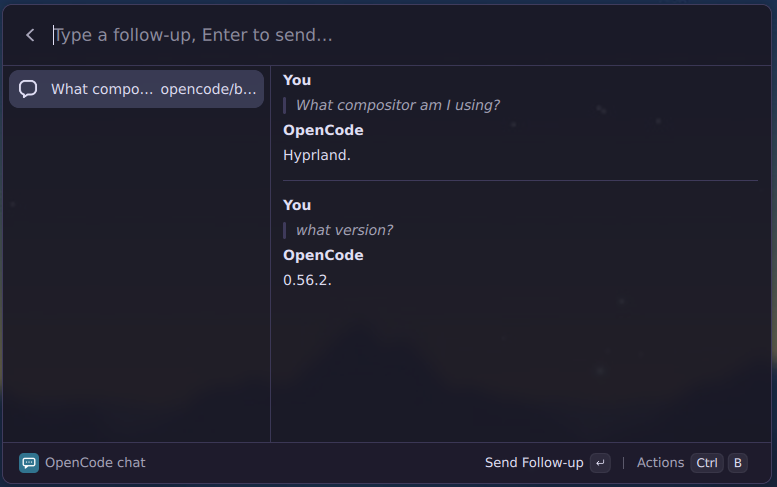

# OpenCode Ask

Ask OpenCode anything without leaving Vicinae. Responses stream straight into the launcher.

## Features

- Ask from root search: fallback row, question-word keywords, or `ai ` prefix
- Streaming answers in a chat view — follow-ups continue the same session
- Recent history to re-ask in one Enter
- Configurable binary, working directory, model, and agent (defaults to `plan`)

## Requirements

`opencode` on `PATH`, Vicinae.

Install with `npm install` + `npm run build`.
